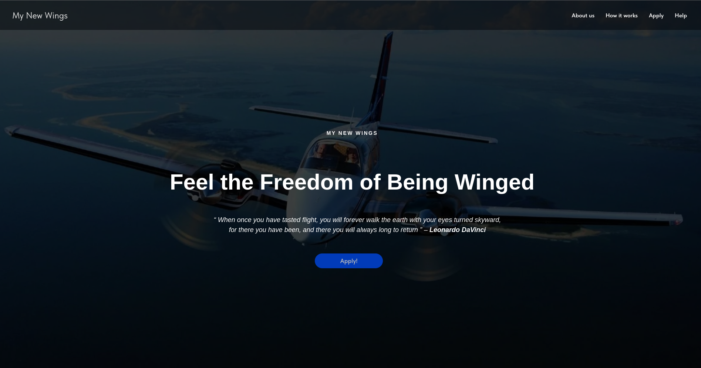
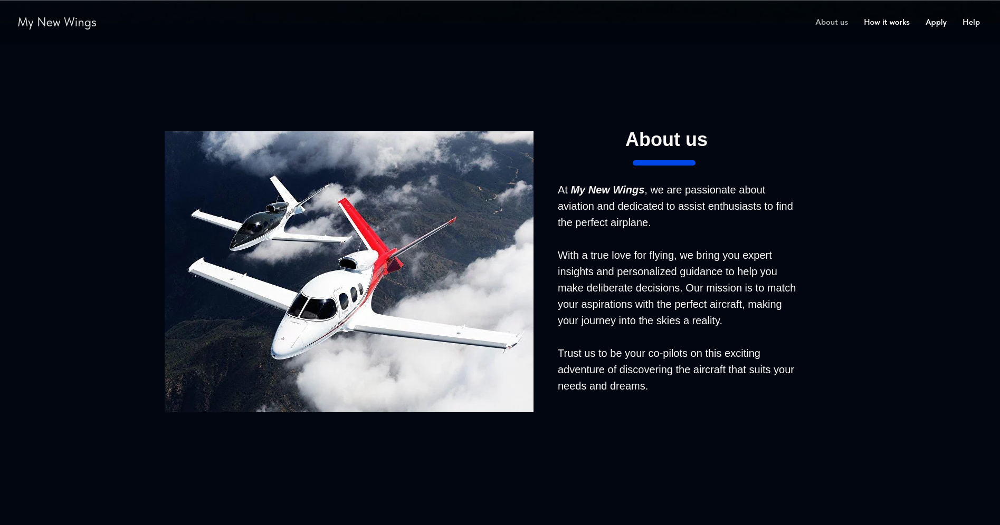
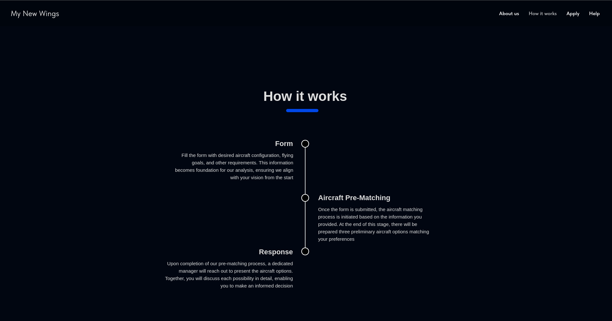
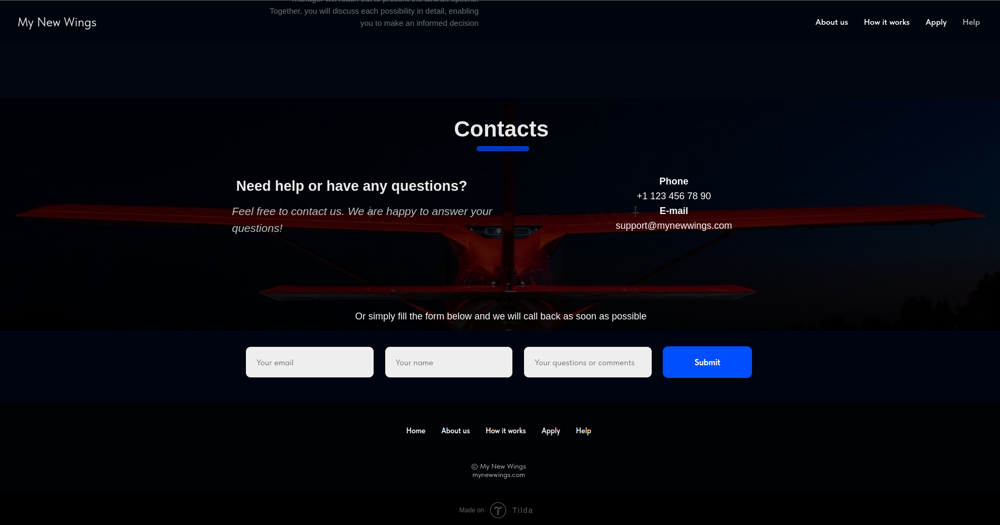
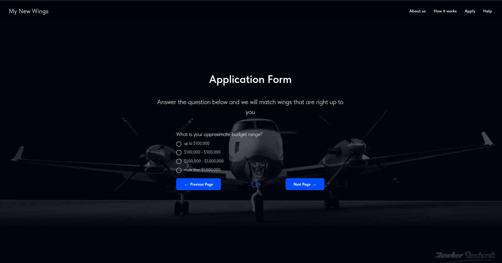
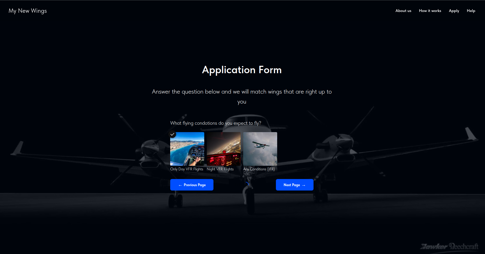
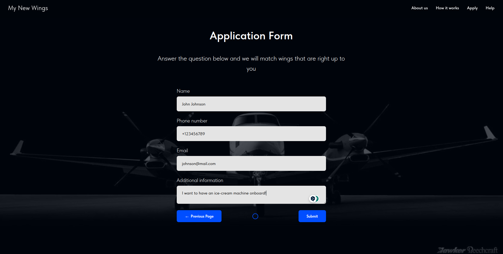
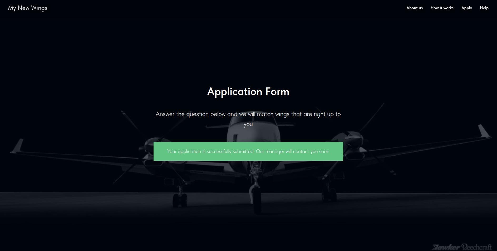

# My New Wings 🚀 🪽

**My New Wings** is an AI-powered tool designed to assist individuals in selecting the ideal general aviation airplane that fits their needs and preferences.

## Workflow

1. **Data Submission:** When users submit the application form, the data is sent to HubSpot CRM via the APIX Drive Webhook integration.

2. **Backend Monitoring:** The backend, built with Django and Celery, observes the HubSpot database using its official API and dispatches a welcome email to new potential customers.

3. **User Validation:** The "My New Wings Manager" assesses user preferences and tags a customer as an "Opportunity."

4. **Opportunity Processing:** Celery is scheduled to check HubSpot every 30 minutes for any entries marked as "Opportunity." When such an entry is detected, the desired airplane data is relayed to a function integrated with OpenAI. This function generates a prompt for ChatGPT, which then suggests three initial aircraft matching the customer's criteria. Subsequently, Celery forwards an email to the identified "Opportunity" user showcasing these aircraft options.

5. **Personalized Assistance:** Post this process, a personal manager continues the interaction with the customer to pinpoint their perfect aircraft.

## Frontend

#### Some Application form pages:

